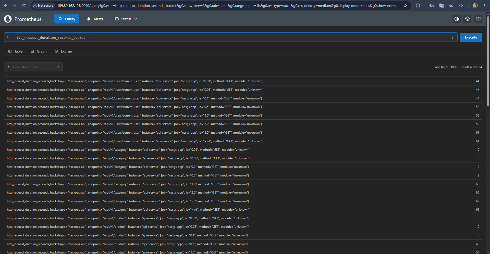

# E-Commerce Inventory Management System

A comprehensive inventory management system for e-commerce store administrators with product management, order tracking, and dashboard analytics.

## Core Features

- 🔐 **Authentication & Authorization** using JWT tokens and secure cookie storage
- 📦 **Product Management** with complete CRUD operations
- 🗂️ **Category Management** with CRUD functionality
- 📊 **Order Tracking & Management**
- 📈 **Admin Dashboard** with key metrics

## Tech Stack

### Frontend

- NextJS
- Tailwind CSS
- Shadcn UI Components

### Backend

- NestJS
- PostgreSQL
- Prisma ORM

## DevOps Architecture

Our project showcases a complete DevOps implementation that creates a complete end-to-end solution where developers can focus solely on writing code while the infrastructure handles everything else. We've built a production-ready system that automates deployment, testing, monitoring, and security, eliminating operational overhead and creating a true "push and forget" development experience. The architecture includes:

### Infrastructure as Code (IaC) with Terraform

- **Terraform** is utilized to automate the provisioning of the core infrastructure on DigitalOcean.
- Specifically, it defines and creates the necessary Droplet (VPS) where the application stack is deployed.
- This approach ensures consistent, repeatable, and version-controlled infrastructure setup, further contributing to the automated environment.

### Containerization

- Separate Dockerfiles for frontend and backend services
- Docker Compose for orchestrating the entire application stack
- Containerized database with data persistence

### Monitoring Stack

- **Prometheus** for metrics collection and alerting
- **Grafana** for visualization dashboards and monitoring
- Configured persistent storage for monitoring data
- Inter-service network communication

### Testing

- Comprehensive Jest unit tests for all backend modules

### CI/CD Pipeline (GitHub Actions)

1.  **CI Pipeline (`build-and-test.yaml`)**: Automated testing (using Jest) on every pull request.
    *   Tests are executed within a dedicated Docker environment using its own PostgreSQL container, ensuring **complete isolation from the production database**.
    *   Integrates **SonarQube** for static code analysis and enforces **Quality Gates**. *Builds will fail if code quality standards are not met*, preventing problematic code from merging.
2.  **Build Pipeline (`push-to-docker.yaml`)**: Automatic Docker image builds for frontend and backend on main branch pushes, tagged and pushed to DockerHub.
3.  **Deployment Pipeline (`deploy-to-vps.yaml`)**: Automatic deployment to the configured VPS using self-hosted GitHub Action runners upon successful builds on the main branch.

### Production Environment

- Deployed on Digital Ocean Droplet
- **Nginx** configured as reverse proxy with rate limiting
- Optimized server configuration for production workloads

## Getting Started

### Local Development

```bash
# Clone the repository
git clone https://github.com/ProDanish203/Hackops-Project.git
cd Hackops-Project

# Start the development environment
docker compose up -d --build
```

### Accessing Services (Local)

- **Frontend**: http://localhost:3000
- **Backend API**: http://localhost:8000
- **Grafana**: http://localhost:3001
- **Prometheus**: http://localhost:9090
- **Database (if exposed)**: Check `compose.yml` for port

## Project Structure

```
├── client/             # NextJS frontend
│   ├── Dockerfile      # Frontend container definition
│   ├── src/            # Code for frontend
│   └── ...
├── server/             # NestJS backend
│   ├── Dockerfile      # Backend container definition
│   ├── src/            # API source code
│   └── ...
├── monitoring/         # Monitoring configuration
│   └── prometheus.yml  # Configuration file for Prometheus
│
├── .github/            # GitHub Action workflows
│   └── workflows/
│       ├── build-and-test.yaml  # CI: Testing & SonarQube analysis pipeline
│       ├── push-to-docker.yaml  # CD: Docker image build & push pipeline
│       └── deploy-to-vps.yaml   # CD: Deployment to VPS pipeline
├── compose.yml         # Service orchestration for Docker (local dev & prod base)
└── nginx.conf          # Nginx configuration (used on VPS)
```

## DevOps Flow

1.  Code changes pushed to a feature branch on GitHub.
2.  A Pull Request is opened to `main`.
3.  GitHub Actions trigger the `build-and-test.yaml` workflow:
    *   Runs automated Jest tests within an isolated Docker environment (including a temporary PostgreSQL database).
    *   Performs **SonarQube** code quality analysis and checks against the Quality Gate.
    *   Reports status back to the Pull Request. The PR cannot be merged if tests or the Quality Gate fail.
4.  On merge or direct push to the `main` branch:
    *   The `push-to-docker.yaml` workflow triggers, building new frontend and backend Docker images and pushing them to the DockerHub registry.
    *   Upon successful image push, the `deploy-to-vps.yaml` workflow triggers.
5.  The deployment action connects to the self-hosted runner on the VPS, pulls the latest Docker images, and restarts the application stack using `docker compose up -d`.
6.  Nginx (running on the VPS) handles incoming requests, applies rate limiting, and reverse proxies requests to the appropriate frontend or backend container.
7.  Prometheus continuously collects metrics from all running services (backend API, potentially frontend/nginx exporters if configured).
8.  Grafana provides visualization and monitoring dashboards using Prometheus as its data source.

### Accessing Services (Production)

- **Frontend**: http://159.89.162.126/
- **Backend API**: http://159.89.162.126/api/v1
- **Grafana**: http://159.89.162.126:3001 (user: admin, password: danish-usman)
- **Prometheus**: http://159.89.162.126:9090
- **SonarQube**: http://159.89.162.126:9000 (user: admin, password: Mynameisusman#10)
- **Docker Image (Client)**: https://hub.docker.com/r/prodanish203/hackops-client
- **Docker Image (Backend)**: https://hub.docker.com/r/prodanish203/hackops-server

*(Note: Ensure SonarQube server details, project keys, and tokens are configured as secrets in your GitHub repository settings for the workflows to function correctly.)*

## Infrastructure & Application Screenshots

### System Architecture


### DevOps Components
#### Grafana Dashboard


#### Prometheus Dashboard

#### Raw Metrics from API

#### SonarQube Dashboard


### Application UI

 (email: danishsidd524@gmail.com, password: Abc12345%)


_Built for the Hackops'25_
